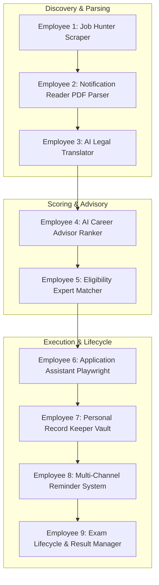

# 🏆 GovtJob AI Agent — The AI Government Career Operating System

> **Tagline:** *"Your Personal AI Government Career Assistant."*  
> **Value Proposition:** An autonomous AI Operating System that discovers, understands, translates, ranks, automates, and manages your entire government career lifecycle.  
> **Status:** Release Candidate (v1.0 RC)


---

## 🌍 Why This Product Exists (The Problem)

Every year in India, over **10,000+ official recruitment notifications** are released across **100+ organizations** (SSC, UPSC, RRB, IBPS, ISRO, DRDO, BHEL, HAL, DMRC, State PSCs, Police, Armed Forces, Apprenticeship India, NCS).

Aspirants face massive friction:
- **Navigation Fatigue**: Checking 100+ separate portals daily.
- **Cognitive Overload**: Reading 150–300 page legal PDF notifications.
- **Complex Jargon**: Legal cut-off dates, category relaxations, and service bonds.
- **Missed Opportunities**: Application deadlines passing unnoticed.
- **Form Filling Friction**: Uploading identical photos/signatures and filling identical bio-data 50+ times per year.

---

## 🤖 The 9 AI Autonomous Employees Architecture

Instead of isolated tools, **GovtJob AI Agent** functions as a team of 9 specialized AI Employees working for you 24/7:



---

### 1️⃣ Employee 1: Job Hunter (24/7 Portal Monitoring)
- Polls SSC, UPSC, Railway, IBPS, NCS, ISRO, DRDO, and State portals every 15–30 minutes.
- Auto-detects new PDF notifications and passes them downstream.

### 2️⃣ Employee 2: Notification Reader (Deep PDF Parsing)
- Reads entire 150–300 page official PDFs using Gemini 3-Pro.
- Extracts salary, posting, probation, bonds, medical standards, syllabus, and cut-off dates.

### 3️⃣ Employee 3: AI Legal Translator (Jargon Elimination)
- Converts dense government legal text into plain English/Hindi.
- *Example*: Explains complex Rule 7 age cut-offs in 1 simple bullet point.

### 4️⃣ Employee 4: AI Career Advisor (Priority Ranking)
- Scores 30+ daily jobs based on fit, salary, and career growth.
- Displays weighted ratings (`⭐ 98/100 High Fit` vs `⭐ 35/100 Low Fit`).

### 5️⃣ Employee 5: Eligibility Expert (Deep Matching)
- Verifies age cut-off, qualifications, category relaxations, physical vision, and height requirements.
- Returns explicit match score: `95% Match — Apply Recommended`.

### 6️⃣ Employee 6: Application Assistant (Human-in-the-Loop Automation)
- Auto-fills browser forms using saved profile & documents.
- **Human-in-the-Loop Hooks**: Pauses gracefully for OTP, CAPTCHA, or UPI Fee Payment, then auto-resumes.

### 7️⃣ Employee 7: Personal Record Keeper (Encrypted Vault)
- Remembers applied, pending, ignored, and failed applications.
- Stores PDF receipt slips, registration numbers, and screenshots automatically.

### 8️⃣ Employee 8: Multi-Channel Reminder System
- Dispatches countdown alerts (24h left, 6h left) via Telegram, Email, and Dashboard.

### 9️⃣ Employee 9: Exam Lifecycle Manager
- Tracks the post-application lifecycle: Admit Card ➔ Exam Date ➔ Answer Key ➔ Result ➔ DV ➔ Joining Letter.

---

## 📱 Telegram Alert Standard (@govtengine_bot)

When a new recruitment is processed by the AI Employees:

```text
🚨 NEW RECRUITMENT DETECTED

Job: SSC CGL 2026
Department: Staff Selection Commission
Salary: ₹44,900 – ₹1,42,400 (Pay Level 7)
Vacancies: 14,567 Posts

Eligibility Audit:
- Age Cut-off: Eligible ✔
- Qualification: Matched (B.Tech CS) ✔
- AI Recommendation Score: 98/100
- Weighted Rating: ⭐⭐⭐⭐⭐ APPLY RECOMMENDED

Reason: Excellent career growth, Permanent Central Govt role, high salary.

[Apply Now ▶]  [Ignore ❌]  [Remind Tomorrow ⏱]
```

---

## 🌟 Pitch Summary: "Not a Notifier, an Operating System"

- **Google Alerts** finds information.
- **ChatGPT** explains information.
- **Browser Automation** completes form fields.
- **Personal Vault** archives receipts.

**GovtJob AI Agent** unifies all four into **one intelligent Government Career Assistant**.
